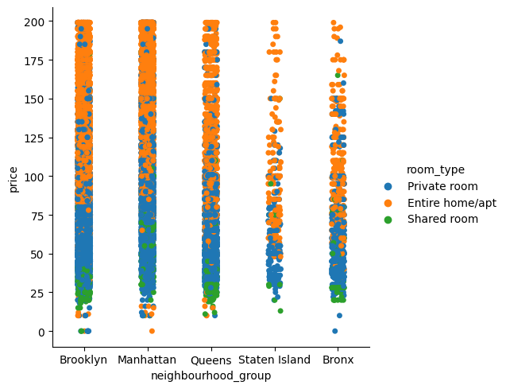
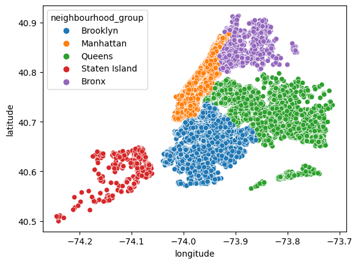
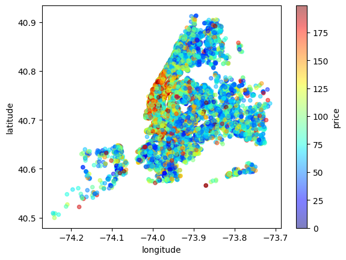
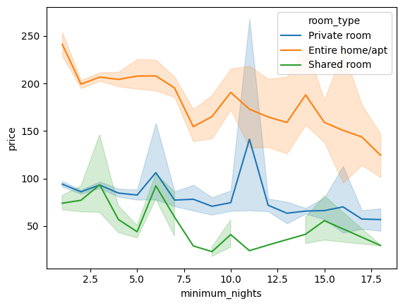

# Unlocking Market Growth Opportunities: A Predictive Analysis of Airbnb Prices in New York

## Table of Contents
1. [Motivation](#motivation)
2. [Project Setup](#project-setup)
3. [Dataset](#dataset)
4. [Data Analysis](#data-analysis)
5. [Data Pipeline and Feature Engineering](#data-pipeline-and-feature-engineering)
6. [Machine Learning Model](#machine-learning-model)
7. [Model Evaluation and Final Results](#model-evaluation-and-final-results)
8. [License](#license)

## Motivation
This project is a comprehensive study that uses regression analysis to predict Airbnb prices in New York. The aim is to identify key factors that influence these prices to understand the rental landscape in NYC better and make informed business decisions.

## Project Setup
To set up the project, create a virtual environment and activate it using the following commands:

```bash
python3 -m venv venv
source venv/bin/activate
```

Then, install the dependencies given in the `requirements.txt` file with:

```bash
pip install -r requirements.txt
```

## Dataset
The dataset used in this project is publicly available on [Kaggle](https://www.kaggle.com/datasets/dgomonov/new-york-city-airbnb-open-data) under the [CC0: Public Domain](https://creativecommons.org/publicdomain/zero/1.0/) license.

## Data Analysis
In the dataset, key features include the neighbourhood_group, the neighbourhood, room_type, minimum number of nights, number of reviews, and reviews per month. A permutation importance analysis was conducted using a preliminary model, revealing that room_type and neighbourhood_group are the most influential features in predicting Airbnb prices. This aligns with expectations, as both the type of accommodation and its location are typically primary factors in rental pricing. The figure bellow provides a visual representation of how prices vary across different room types, further emphasizing the significance of these features in our analysis:



The provided figure offers a visual representation of the geographical demarcations of various neighbourhood groups within New York City:



As illustrated in the subsequent figure, Manhattan boasts the highest per-night prices.



Another interesting observation from the analysis is that, on average, locations requiring a higher minimum number of nights tend to have lower per-night prices. This trend is clearly depicted in the following figure:



## Data Pipeline and Feature Engineering
The most important steps taken in the data pipeline and feature engineering process include:
1. **Imputation** using the mean was performed on the reviews_per_month column, followed by feature engineering to identify instances where reviews per month were less than 0.1.
2. **Ordinal encoding** was applied to the room_type column.
3. The neighbourhood_group column underwent **one-hot encoding**.
4. **Target encoding** was used as a feature engineering technique on the neighbourhood column.

## Machine Learning Model
A **TensorFlow** fully connected **neural network** was used with the following parameters:

| Parameter         | Value       |
|-------------------|-------------|
| n_layers          | 4           |
| n_units           | 256         |
| dropout_rate      | 0.3         |
| input_shape       | 17          |
| activation        | ReLU        |
| output_units      | 1           |
| output_activation | linear      |

The loss function used was MAE and optimization was done using Adam optimizer with early stopping.

## Model Evaluation and Final Result
After optimizing the hyperparameters, the best MAE score reached was 52.47.

## License
This project is under [CC0-1.0 license](https://creativecommons.org/publicdomain/zero/1.0/).
